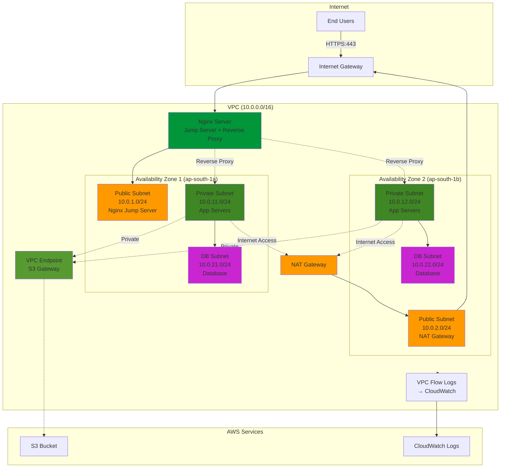

# Secure Multi-Tier VPC Architecture
## Nginx Jump Server with Reverse Proxy Design

## Architecture Overview

This design creates a **3-tier architecture** with an Nginx server acting as both a jump server and reverse proxy, complete network isolation, controlled internet access, and zero public exposure for application and database servers.

## Architecture Diagram



---

## Network Architecture Breakdown

### 🌐 VPC Structure

| Component | CIDR Block | Purpose |
|-----------|------------|---------|
| **VPC** | `10.0.0.0/16` | Main network (65,536 IPs) |
| **Public Subnet AZ1** | `10.0.1.0/24` | Load balancer (256 IPs) |
| **Public Subnet AZ2** | `10.0.2.0/24` | NAT Gateway (256 IPs) |
| **Private Subnet AZ1** | `10.0.11.0/24` | App servers (256 IPs) |
| **Private Subnet AZ2** | `10.0.12.0/24` | App servers (256 IPs) |
| **DB Subnet AZ1** | `10.0.21.0/24` | Database (256 IPs) |
| **DB Subnet AZ2** | `10.0.22.0/24` | Database (256 IPs) |

---

## Traffic Flow

### 1️⃣ **Inbound Traffic (User → Application)**

```
End User → Internet → Internet Gateway → Nginx Server (Public Subnet) 
→ Reverse Proxy → App Server (Private Subnet) → Database (DB Subnet)
```

### 2️⃣ **Outbound Traffic (Application → Internet)**

```
App Server (Private Subnet) → NAT Gateway (Public Subnet) 
→ Internet Gateway → Internet
```

### 3️⃣ **AWS Service Access (Private - S3 Only)**

```
App Server (Private Subnet) → VPC Endpoint (Gateway) → S3 Bucket
(Traffic never leaves AWS network)
```

### 4️⃣ **SSH/Management Access (Jump Server)**

```
Admin → Internet → Internet Gateway → Nginx Server (Public Subnet)
→ SSH Jump → App Server (Private Subnet)
```

---

## Security Layers

### 🔒 Layer 1: Network Isolation

- ✅ **Public Subnets**: Only ALB and NAT Gateway
- ✅ **Private Subnets**: App servers (NO public IPs)
- ✅ **DB Subnets**: Databases (NO internet access at all)

### 🔒 Layer 2: Route Tables

**Public Subnet Route Table:**
```
Destination         Target
10.0.0.0/16        local (VPC)
0.0.0.0/0          igw-xxxxx (Internet Gateway)
```

**Private Subnet Route Table:**
```
Destination         Target
10.0.0.0/16        local (VPC)
0.0.0.0/0          nat-xxxxx (NAT Gateway)
S3 prefix-list     vpce-xxxxx (S3 Endpoint)
```

**DB Subnet Route Table:**
```
Destination         Target
10.0.0.0/16        local (VPC)
(NO internet route - fully isolated)
```

### 🔒 Layer 3: Security Groups

**Nginx Jump Server Security Group:**
```
Inbound:  Port 443 from 0.0.0.0/0 (HTTPS from internet)
Inbound:  Port 22 from YOUR_IP/32 (SSH for management)
Outbound: Port 8080 to App Server SG (reverse proxy)
Outbound: Port 22 to App Server SG (SSH jump)
```

**App Server Security Group:**
```
Inbound:  Port 8080 from Nginx SG only (app traffic)
Inbound:  Port 22 from Nginx SG only (SSH via jump)
Outbound: Port 5432 to DB SG (database access)
Outbound: Port 443 to 0.0.0.0/0 (updates via NAT)
```

**Database Security Group:**
```
Inbound:  Port 5432 from App Server SG only
Outbound: NONE (no outbound traffic needed)
```

### 🔒 Layer 4: NACLs (Network ACLs)

**Public Subnet NACL:**
- Allow inbound HTTPS (443) from internet
- Allow outbound to private subnets

**Private Subnet NACL:**
- Allow inbound from ALB
- Allow outbound to internet via NAT
- Allow outbound to DB subnets

**DB Subnet NACL:**
- Allow inbound from private subnets only
- Deny all other traffic

---

## VPC Endpoints (Private AWS Access)

### Gateway Endpoint (Free)
- **S3**: For storing logs, backups, static assets
  - Type: Gateway
  - Route table entry added automatically
  - No additional cost
  - Reduces NAT Gateway data transfer costs

**Why S3 Gateway Endpoint?**
- ✅ Free (no hourly or data charges)
- ✅ Keeps S3 traffic on AWS private network
- ✅ Reduces NAT Gateway costs (NAT charges for data transfer)
- ✅ Better performance and security

---

## VPC Flow Logs (Traffic Observability)

**Configuration:**
```
Source: VPC (captures all traffic)
Destination: CloudWatch Logs
Filter: ALL (accepted and rejected traffic)
Format: Default
```

**What You Can Monitor:**
- ✅ All connection attempts (source/destination IPs)
- ✅ Accepted vs rejected traffic
- ✅ Traffic patterns and anomalies
- ✅ Security group rule effectiveness
- ✅ Compliance and audit trails

---

## Component Roles

| Component | Purpose | Public IP? | Internet Access? |
|-----------|---------|------------|------------------|
| **Nginx Jump Server** | Reverse proxy + SSH bastion | ✅ Yes | ✅ Yes (inbound/outbound) |
| **NAT Gateway** | Outbound internet for private subnets | ✅ Yes | ✅ Yes (outbound only) |
| **App Servers** | Run application code | ❌ No | ✅ Yes (via NAT) |
| **Databases** | Store data | ❌ No | ❌ No |
| **S3 VPC Endpoint** | Private S3 access | ❌ No | N/A (private) |

---

## High Availability Design

### Multi-AZ Deployment

- ✅ **2 Availability Zones** (ap-south-1a, ap-south-1b)
- ✅ **Nginx server** in AZ1 (can add second with DNS round-robin for HA)
- ✅ **NAT Gateway** in AZ2 (can add second in AZ1 for HA)
- ✅ **App servers** distributed across both AZs
- ✅ **RDS Multi-AZ** for automatic database failover

### Fault Tolerance

- If AZ1 fails → Can add second Nginx in AZ2 with Route 53 failover
- If NAT Gateway fails → Add second NAT in AZ1 with route table failover
- If database fails → RDS automatically fails over to standby in AZ2

---

## Key Security Features

### ✅ Zero Public Exposure
- App servers have NO public IPs
- Databases have NO internet access
- SSH access only via Nginx jump server (single entry point)

### ✅ Least Privilege Network Access
- Security groups use source/destination SG references
- NACLs provide subnet-level protection
- Route tables enforce traffic paths
- Jump server provides controlled SSH access

### ✅ Private AWS Service Access
- S3 VPC endpoint keeps S3 traffic on AWS backbone
- No S3 data traverses public internet
- Reduces NAT Gateway data transfer costs

### ✅ Full Traffic Visibility
- VPC Flow Logs capture all network traffic
- CloudWatch integration for monitoring
- Can export to S3 for long-term analysis

---

## Cost Optimization

| Component | Cost | Optimization |
|-----------|------|--------------|
| **Nginx EC2 (t3.micro)** | ~$0.01/hour | Use spot instance or reserved instance |
| **NAT Gateway** | ~$0.045/hour + $0.045/GB | Use S3 VPC endpoint to reduce data transfer |
| **S3 VPC Endpoint (Gateway)** | **FREE** | Always use for S3 access |
| **VPC Flow Logs** | CloudWatch storage costs | Filter to capture only rejected traffic |

**Monthly Cost Estimate (Mumbai region):**
- Nginx t3.micro: ~$7.50/month
- NAT Gateway: ~$32/month + data transfer
- S3 Endpoint: $0 (free)
- Total: ~$40-50/month (excluding data transfer)

---

## Simplified Visual

```
┌─────────────────────────────────────────────────────────────┐
│                         INTERNET                            │
└────────────────────┬────────────────────────────────────────┘
                     │
              ┌──────▼──────┐
              │   Internet  │
              │   Gateway   │
              └──────┬──────┘
                     │
    ┌────────────────┼────────────────┐
    │                │                │
┌───▼────┐      ┌───▼────┐      ┌───▼────┐
│ Nginx  │      │  NAT   │      │  VPC   │
│ Jump + │      │Gateway │      │Endpoint│
│ Proxy  │      └───▲────┘      │  (S3)  │
└───┬────┘          │           └───▲────┘
    │               │               │
    │         ┌─────┴─────┐         │
    │         │           │         │
┌───▼─────────▼───┐   ┌───▼─────────▼───┐
│  App Server 1   │   │  App Server 2   │
│ Private Subnet  │   │ Private Subnet  │
│  (AZ1)          │   │  (AZ2)          │
└───┬─────────────┘   └───┬─────────────┘
    │                     │
    └──────────┬──────────┘
               │
        ┌──────▼──────┐
        │  Database   │
        │  DB Subnet  │
        │ (Isolated)  │
        │  Multi-AZ   │
        └─────────────┘

Legend:
🟧 Public Subnet  - Nginx Jump Server, NAT Gateway
🟩 Private Subnet - App Servers (no public IP)
🟪 DB Subnet      - Database (no internet access)
```

---

## Real-World Use Cases

1. **E-commerce Platform**: Web servers in private subnets, RDS in DB subnets
2. **SaaS Application**: Multi-tenant app with isolated database layer
3. **Enterprise Application**: Internal apps with strict security requirements
4. **Microservices**: Each service in private subnets, API Gateway in public

---

## Next Steps

1. Create VPC and subnets
2. Set up Internet Gateway and NAT Gateway
3. Configure route tables
4. Create security groups
5. Deploy resources (ALB, EC2, RDS)
6. Set up VPC endpoints
7. Enable VPC Flow Logs
8. Test connectivity and security
