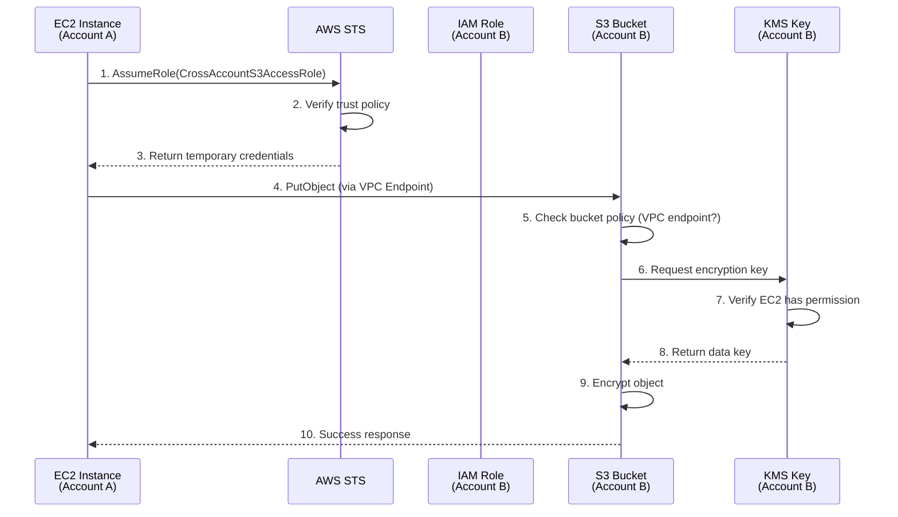

# Cross-Account Secure S3 Storage Solution

## Architecture Overview

This solution demonstrates enterprise-grade data sharing between two AWS accounts with multiple security layers:

- **Account A (Source)**: Contains an EC2 instance that needs to access data
- **Account B (Storage)**: Contains the encrypted S3 bucket with the data

### Security Layers
1. ✅ Cross-account IAM role with trust relationship
2. ✅ S3 bucket encryption using KMS
3. ✅ Block all public access
4. ✅ VPC endpoint restriction (private network only)
5. ✅ Least privilege IAM policies

---

## Prerequisites

- Two AWS accounts (we'll call them Account A and Account B)
- Account A ID: `111111111111` (replace with your actual Account A ID)
- Account B ID: `222222222222` (replace with your actual Account B ID)
- A VPC in Account A with a subnet

---

## Implementation Steps

### Phase 1: Setup Account B (Storage Account)

#### Step 1: Create KMS Key in Account B

> [!IMPORTANT]
> The KMS key must allow Account A to use it for encryption/decryption

1. **Navigate to KMS Console** in Account B
   - Go to AWS Console → KMS → Customer managed keys → Create key

2. **Configure Key**
   - Key type: `Symmetric`
   - Key usage: `Encrypt and decrypt`
   - Click **Next**

3. **Add Labels**
   - Alias: `cross-account-s3-key`
   - Description: `KMS key for cross-account S3 bucket encryption`
   - Click **Next**

4. **Define Key Administrative Permissions**
   - Select your admin user/role
   - Click **Next**

5. **Define Key Usage Permissions**
   - Click **Next** (we'll edit the policy manually)

6. **Edit Key Policy** - Replace with this policy:

```json
{
  "Version": "2012-10-17",
  "Statement": [
    {
      "Sid": "Enable IAM User Permissions",
      "Effect": "Allow",
      "Principal": {
        "AWS": "arn:aws:iam::222222222222:root"
      },
      "Action": "kms:*",
      "Resource": "*"
    },
    {
      "Sid": "Allow Account A to use the key",
      "Effect": "Allow",
      "Principal": {
        "AWS": "arn:aws:iam::111111111111:root"
      },
      "Action": [
        "kms:Decrypt",
        "kms:DescribeKey",
        "kms:GenerateDataKey"
      ],
      "Resource": "*"
    }
  ]
}
```

7. **Save the KMS Key ARN** - You'll need it later
   - Example: `arn:aws:kms:us-east-1:222222222222:key/12345678-1234-1234-1234-123456789012`

---

#### Step 2: Create S3 Bucket in Account B

1. **Navigate to S3 Console** in Account B
   - Go to S3 → Create bucket

2. **Configure Bucket**
   - Bucket name: `cross-account-secure-bucket-demo` (must be globally unique)
   - Region: `us-east-1` (or your preferred region)
   - **Block Public Access**: Keep all 4 checkboxes **CHECKED** ✅
   - Click **Create bucket**

3. **Enable Default Encryption**
   - Go to bucket → Properties → Default encryption → Edit
   - Encryption type: `SSE-KMS`
   - AWS KMS key: Choose the key you created (`cross-account-s3-key`)
   - Bucket Key: `Enabled` (reduces KMS costs)
   - Click **Save changes**

---

#### Step 3: Create IAM Role in Account B

> [!IMPORTANT]
> This role will be assumed by the EC2 instance in Account A

1. **Navigate to IAM Console** in Account B
   - Go to IAM → Roles → Create role

2. **Select Trusted Entity**
   - Trusted entity type: `AWS account`
   - Select: `Another AWS account`
   - Account ID: `111111111111` (Account A's ID)
   - Click **Next**

3. **Skip Permission Policies** (we'll add inline policy)
   - Click **Next**

4. **Name the Role**
   - Role name: `CrossAccountS3AccessRole`
   - Description: `Allows Account A EC2 to access encrypted S3 bucket`
   - Click **Create role**

5. **Add Inline Policy to the Role**
   - Go to the role → Permissions → Add permissions → Create inline policy
   - Switch to **JSON** tab and paste:

```json
{
  "Version": "2012-10-17",
  "Statement": [
    {
      "Sid": "S3BucketAccess",
      "Effect": "Allow",
      "Action": [
        "s3:GetObject",
        "s3:PutObject",
        "s3:ListBucket"
      ],
      "Resource": [
        "arn:aws:s3:::cross-account-secure-bucket-demo",
        "arn:aws:s3:::cross-account-secure-bucket-demo/*"
      ]
    },
    {
      "Sid": "KMSKeyAccess",
      "Effect": "Allow",
      "Action": [
        "kms:Decrypt",
        "kms:GenerateDataKey",
        "kms:DescribeKey"
      ],
      "Resource": "arn:aws:kms:us-east-1:222222222222:key/12345678-1234-1234-1234-123456789012"
    }
  ]
}
```

   - Policy name: `S3AndKMSAccess`
   - Click **Create policy**

6. **Save the Role ARN**
   - Example: `arn:aws:iam::222222222222:role/CrossAccountS3AccessRole`

---

#### Step 4: Add Bucket Policy to Restrict Access to VPC Endpoint

> [!WARNING]
> This step requires the VPC Endpoint ID from Account A. We'll create the endpoint first, then come back to add this policy.

**We'll complete this after Step 6 in Account A**

---

### Phase 2: Setup Account A (Source Account)

#### Step 5: Create IAM Role for EC2 Instance in Account A

1. **Navigate to IAM Console** in Account A
   - Go to IAM → Roles → Create role

2. **Select Trusted Entity**
   - Trusted entity type: `AWS service`
   - Use case: `EC2`
   - Click **Next**

3. **Skip Permission Policies**
   - Click **Next**

4. **Name the Role**
   - Role name: `EC2CrossAccountAssumeRole`
   - Description: `Allows EC2 to assume role in Account B`
   - Click **Create role**

5. **Add Inline Policy**
   - Go to the role → Permissions → Add permissions → Create inline policy
   - Switch to **JSON** tab:

```json
{
  "Version": "2012-10-17",
  "Statement": [
    {
      "Effect": "Allow",
      "Action": "sts:AssumeRole",
      "Resource": "arn:aws:iam::222222222222:role/CrossAccountS3AccessRole"
    }
  ]
}
```

   - Policy name: `AssumeRoleInAccountB`
   - Click **Create policy**

---

#### Step 6: Create VPC Endpoint for S3 in Account A

1. **Navigate to VPC Console** in Account A
   - Go to VPC → Endpoints → Create endpoint

2. **Configure Endpoint**
   - Name: `s3-gateway-endpoint`
   - Service category: `AWS services`
   - Services: Search for `s3` and select `com.amazonaws.us-east-1.s3` (Gateway type)
   - VPC: Select your VPC
   - Route tables: Select the route table associated with your subnet
   - Policy: `Full access` (for now)
   - Click **Create endpoint**

3. **Save the VPC Endpoint ID**
   - Example: `vpce-0a1b2c3d4e5f6g7h8`

---

#### Step 7: Complete Bucket Policy in Account B (Return to Account B)

Now that we have the VPC Endpoint ID, let's restrict bucket access.

1. **Navigate to S3 Console** in Account B
   - Go to your bucket → Permissions → Bucket policy → Edit

2. **Add This Bucket Policy**:

```json
{
  "Version": "2012-10-17",
  "Statement": [
    {
      "Sid": "DenyAllExceptVPCEndpoint",
      "Effect": "Deny",
      "Principal": "*",
      "Action": "s3:*",
      "Resource": [
        "arn:aws:s3:::cross-account-secure-bucket-demo",
        "arn:aws:s3:::cross-account-secure-bucket-demo/*"
      ],
      "Condition": {
        "StringNotEquals": {
          "aws:SourceVpce": "vpce-0a1b2c3d4e5f6g7h8"
        }
      }
    },
    {
      "Sid": "AllowCrossAccountRole",
      "Effect": "Allow",
      "Principal": {
        "AWS": "arn:aws:iam::222222222222:role/CrossAccountS3AccessRole"
      },
      "Action": [
        "s3:GetObject",
        "s3:PutObject",
        "s3:ListBucket"
      ],
      "Resource": [
        "arn:aws:s3:::cross-account-secure-bucket-demo",
        "arn:aws:s3:::cross-account-secure-bucket-demo/*"
      ]
    }
  ]
}
```

3. **Click Save changes**

---

#### Step 8: Launch EC2 Instance in Account A

1. **Navigate to EC2 Console** in Account A
   - Go to EC2 → Instances → Launch instances

2. **Configure Instance**
   - Name: `cross-account-test-instance`
   - AMI: `Amazon Linux 2023` (or Amazon Linux 2)
   - Instance type: `t2.micro` (free tier eligible)
   - Key pair: Create or select existing
   - Network settings:
     - VPC: Select the VPC with the S3 endpoint
     - Subnet: Select a private subnet (or public if testing)
     - Auto-assign public IP: Enable (if you need SSH access)
   - **IAM instance profile**: Select `EC2CrossAccountAssumeRole`
   - Click **Launch instance**

3. **Wait for Instance to be Running**

---

### Phase 3: Testing and Verification

#### Step 9: Connect to EC2 Instance and Test Access

1. **SSH into the EC2 Instance**

```bash
ssh -i your-key.pem ec2-user@<instance-public-ip>
```

2. **Verify Instance Profile**

```bash
aws sts get-caller-identity
```

Expected output shows Account A identity.

3. **Assume the Role in Account B**

```bash
aws sts assume-role \
  --role-arn "arn:aws:iam::222222222222:role/CrossAccountS3AccessRole" \
  --role-session-name "cross-account-session"
```

This will return temporary credentials. Save them:
- `AccessKeyId`
- `SecretAccessKey`
- `SessionToken`

4. **Export the Temporary Credentials**

```bash
export AWS_ACCESS_KEY_ID="<AccessKeyId>"
export AWS_SECRET_ACCESS_KEY="<SecretAccessKey>"
export AWS_SESSION_TOKEN="<SessionToken>"
```

5. **Verify Assumed Role**

```bash
aws sts get-caller-identity
```

Now you should see Account B's role ARN.

6. **Test S3 Access - Upload a File**

```bash
echo "Hello from Account A!" > test-file.txt

aws s3 cp test-file.txt s3://cross-account-secure-bucket-demo/test-file.txt
```

7. **Test S3 Access - List Bucket**

```bash
aws s3 ls s3://cross-account-secure-bucket-demo/
```

8. **Test S3 Access - Download File**

```bash
aws s3 cp s3://cross-account-secure-bucket-demo/test-file.txt downloaded-file.txt
cat downloaded-file.txt
```

---

## Security Verification Checklist

### ✅ Test 1: Public Access Blocked

Try accessing the bucket from your local machine (not from EC2):

```bash
aws s3 ls s3://cross-account-secure-bucket-demo/ --profile account-b
```

**Expected**: Access Denied (due to VPC endpoint restriction)

### ✅ Test 2: VPC Endpoint Enforcement

From the EC2 instance, try accessing without assuming the role:

```bash
unset AWS_ACCESS_KEY_ID AWS_SECRET_ACCESS_KEY AWS_SESSION_TOKEN
aws s3 ls s3://cross-account-secure-bucket-demo/
```

**Expected**: Access Denied (instance profile doesn't have S3 permissions)

### ✅ Test 3: Encryption Verification

Check if the uploaded file is encrypted:

```bash
aws s3api head-object \
  --bucket cross-account-secure-bucket-demo \
  --key test-file.txt
```

Look for `ServerSideEncryption: aws:kms` in the output.

### ✅ Test 4: Least Privilege

Try to delete the bucket (should fail):

```bash
aws s3 rb s3://cross-account-secure-bucket-demo --force
```

**Expected**: Access Denied (role only has Get/Put/List, not Delete)

---

## Architecture Diagram



---

## Key Concepts Summary

| Concept | Purpose | Security Benefit |
|---------|---------|------------------|
| **Cross-Account Role** | Allows Account A to access Account B resources | No need to share long-term credentials |
| **Trust Policy** | Defines who can assume the role | Restricts access to specific accounts |
| **SSE-KMS** | Encrypts data at rest using customer-managed key | Full control over encryption keys |
| **KMS Key Policy** | Controls who can use the encryption key | Prevents unauthorized decryption |
| **VPC Endpoint** | Private connection to S3 | Data never traverses public internet |
| **Bucket Policy** | Enforces VPC endpoint usage | Blocks access from outside the VPC |
| **Block Public Access** | Prevents accidental public exposure | Defense in depth |
| **Least Privilege IAM** | Grants only necessary permissions | Limits blast radius of compromise |

---

## Troubleshooting

### Issue: "Access Denied" when assuming role

**Solution**: Check trust policy in Account B role allows Account A

### Issue: "Access Denied" when accessing S3

**Solution**: 
1. Verify you've assumed the role (check `aws sts get-caller-identity`)
2. Check bucket policy allows the VPC endpoint
3. Verify VPC endpoint is in the route table

### Issue: KMS encryption errors

**Solution**: Verify KMS key policy allows Account A to use the key

### Issue: Can't connect to EC2

**Solution**: Ensure security group allows SSH (port 22) from your IP

---

## Cleanup Steps

To avoid AWS charges, delete resources in this order:

### Account A
1. Terminate EC2 instance
2. Delete VPC endpoint
3. Delete IAM role `EC2CrossAccountAssumeRole`

### Account B
1. Empty S3 bucket (delete all objects)
2. Delete S3 bucket
3. Delete IAM role `CrossAccountS3AccessRole`
4. Schedule KMS key deletion (7-30 day waiting period)

---

## Real-World Use Cases

1. **Multi-Account Organization**: Dev account accessing production data lake
2. **Partner Data Sharing**: Securely sharing datasets with external organizations
3. **Compliance Requirements**: Separating data storage from compute for audit trails
4. **Disaster Recovery**: Cross-region, cross-account backups

---

## Next Steps to Enhance

- Add CloudTrail logging for audit trails
- Implement S3 bucket versioning
- Add SNS notifications for bucket events
- Use AWS Organizations for centralized management
- Implement SCPs (Service Control Policies) for additional guardrails
